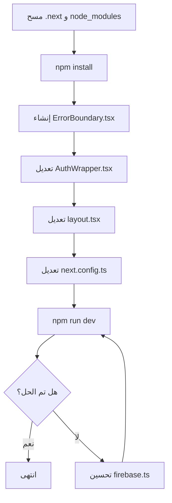

# خطة حل مشكلة ChunkLoadError

## 📋 وصف المشكلة

```
ChunkLoadError: Loading chunk app/layout failed.
(timeout: http://localhost:3000/_next/static/chunks/app/layout.js)
```

الخطأ يحدث في ملف [`layout.tsx`](../src/app/layout.tsx:27) عند السطر 27 حيث يتم استدعاء مكون `<AuthWrapper>`.

---

## 🔍 تحليل السبب الجذري

### ما هو ChunkLoadError؟

هذا الخطأ يحدث عندما يفشل المتصفح في تحميل ملف JavaScript chunk من الخادم. الأسباب المحتملة:

1. **مشكلة في ذاكرة التخزين المؤقت (Cache)** - ملفات `.next` القديمة تتعارض مع الملفات الجديدة
2. **مشكلة في الشبكة أو timeout** - الخادم بطيء في الاستجابة
3. **حجم الملفات كبير جداً** - المكونات المستوردة ثقيلة
4. **تعارض في الإصدارات** - عدم توافق بين الحزم

### المكونات المتأثرة

```
layout.tsx
    └── AuthWrapper.tsx (client component)
            ├── AuthContext.tsx (يستورد Firebase)
            ├── StudentContext.tsx (يستورد Firebase + أنواع كثيرة)
            └── ClientLayout.tsx (يستورد مكونات UI كثيرة)
```

### الملاحظات من التحليل

1. **Firebase SDK** - يتم استيراده في عدة ملفات مما يزيد حجم الـ bundle
2. **StudentContext.tsx** - ملف ضخم (929 سطر) يحتوي على منطق معقد
3. **ClientLayout.tsx** - يستورد أكثر من 30 مكون UI
4. **Next.js 15.3.8** - إصدار حديث قد يحتاج تحديثات

---

## ✅ خطوات الحل

### الخطوة 1: مسح ذاكرة التخزين المؤقت

```bash
# حذف مجلد .next
rm -rf .next

# حذف node_modules وإعادة التثبيت
rm -rf node_modules
npm install

# إعادة تشغيل الخادم
npm run dev
```

### الخطوة 2: تحسين استيراد Firebase (Dynamic Import)

تعديل ملف [`firebase.ts`](../src/lib/firebase.ts) لاستخدام الاستيراد الديناميكي:

```typescript
// قبل
import { initializeApp, getApp, getApps } from 'firebase/app';
import { getAuth } from 'firebase/auth';
import { getDatabase } from 'firebase/database';
import { getStorage } from 'firebase/storage';

// بعد - استخدام lazy loading
let firebaseApp: any = null;
let firebaseAuth: any = null;
let firebaseDb: any = null;
let firebaseStorage: any = null;

export const getFirebaseApp = async () => {
  if (!firebaseApp) {
    const { initializeApp, getApp, getApps } = await import('firebase/app');
    firebaseApp = getApps().length ? getApp() : initializeApp(firebaseConfig);
  }
  return firebaseApp;
};
```

### الخطوة 3: تقسيم AuthWrapper إلى مكونات أصغر

تعديل [`AuthWrapper.tsx`](../src/components/ui/AuthWrapper.tsx) لاستخدام `dynamic` من Next.js:

```typescript
"use client";

import React, { Suspense } from 'react';
import dynamic from 'next/dynamic';
import { Loader2 } from 'lucide-react';

// تحميل ديناميكي للمكونات الثقيلة
const AuthProvider = dynamic(
  () => import('@/context/AuthContext').then(mod => ({ default: mod.AuthProvider })),
  { ssr: false }
);

const StudentProvider = dynamic(
  () => import('@/context/StudentContext').then(mod => ({ default: mod.StudentProvider })),
  { ssr: false }
);

const ClientLayout = dynamic(
  () => import('./ClientLayout').then(mod => ({ default: mod.ClientLayout })),
  { 
    ssr: false,
    loading: () => (
      <div className="flex items-center justify-center min-h-screen">
        <Loader2 className="h-12 w-12 animate-spin text-primary" />
      </div>
    )
  }
);

export function AuthWrapper({ children }: { children: React.ReactNode }) {
  return (
    <Suspense fallback={<div className="flex items-center justify-center min-h-screen"><Loader2 className="h-12 w-12 animate-spin" /></div>}>
      <AuthProvider>
        <StudentProvider>
          <ClientLayout>{children}</ClientLayout>
        </StudentProvider>
      </AuthProvider>
    </Suspense>
  );
}
```

### الخطوة 4: إضافة Error Boundary

إنشاء ملف جديد `src/components/ui/ErrorBoundary.tsx`:

```typescript
"use client";

import React from 'react';

interface Props {
  children: React.ReactNode;
  fallback?: React.ReactNode;
}

interface State {
  hasError: boolean;
  error?: Error;
}

export class ErrorBoundary extends React.Component<Props, State> {
  constructor(props: Props) {
    super(props);
    this.state = { hasError: false };
  }

  static getDerivedStateFromError(error: Error): State {
    return { hasError: true, error };
  }

  componentDidCatch(error: Error, errorInfo: React.ErrorInfo) {
    console.error('Error caught by boundary:', error, errorInfo);
  }

  render() {
    if (this.state.hasError) {
      return this.props.fallback || (
        <div className="flex flex-col items-center justify-center min-h-screen p-4">
          <h2 className="text-xl font-bold mb-4">حدث خطأ في التحميل</h2>
          <p className="text-muted-foreground mb-4">يرجى تحديث الصفحة</p>
          <button 
            onClick={() => window.location.reload()}
            className="px-4 py-2 bg-primary text-white rounded-lg"
          >
            تحديث الصفحة
          </button>
        </div>
      );
    }

    return this.props.children;
  }
}
```

### الخطوة 5: تحديث layout.tsx

```typescript
import type { Metadata } from 'next';
import './globals.css';
import { AuthWrapper } from '@/components/ui/AuthWrapper';
import { ErrorBoundary } from '@/components/ui/ErrorBoundary';
import { Toaster } from '@/components/ui/toaster';

export const metadata: Metadata = {
  title: 'مدير مدرسة الشافعي',
  description: 'إدارة مدرسة الإمام الشافعي القرآنية',
  manifest: '/manifest.json',
};

export default function RootLayout({
  children,
}: Readonly<{
  children: React.ReactNode;
}>) {
  return (
    <html lang="ar" dir="rtl" suppressHydrationWarning>
      <head>
        <link rel="preconnect" href="https://fonts.googleapis.com" />
        <link rel="preconnect" href="https://fonts.gstatic.com" crossOrigin="anonymous" />
        <link href="https://fonts.googleapis.com/css2?family=Cairo:wght@400;700&display=swap" rel="stylesheet" />
      </head>
      <body className="font-body antialiased">
        <ErrorBoundary>
          <AuthWrapper>
            {children}
          </AuthWrapper>
        </ErrorBoundary>
        <Toaster />
      </body>
    </html>
  );
}
```

### الخطوة 6: تحسين إعدادات Next.js

تعديل [`next.config.ts`](../next.config.ts):

```typescript
import type { NextConfig } from 'next';

const nextConfig: NextConfig = {
  typescript: {
    ignoreBuildErrors: true,
  },
  eslint: {
    ignoreDuringBuilds: true,
  },
  images: {
    remotePatterns: [
      {
        protocol: 'https',
        hostname: 'placehold.co',
        port: '',
        pathname: '/**',
      },
    ],
  },
  // إضافة تحسينات للـ chunks
  experimental: {
    optimizePackageImports: ['lucide-react', 'date-fns', 'firebase'],
  },
  // تقسيم الـ chunks بشكل أفضل
  webpack: (config, { isServer }) => {
    if (!isServer) {
      config.optimization.splitChunks = {
        chunks: 'all',
        minSize: 20000,
        maxSize: 244000,
        cacheGroups: {
          firebase: {
            test: /[\\/]node_modules[\\/]firebase[\\/]/,
            name: 'firebase',
            priority: 10,
          },
          vendor: {
            test: /[\\/]node_modules[\\/]/,
            name: 'vendors',
            priority: -10,
          },
        },
      };
    }
    return config;
  },
  async redirects() {
    return [
      {
        source: '/reports/monthly',
        destination: '/dues',
        permanent: true,
      },
      {
        source: '/overview',
        destination: '/home',
        permanent: true,
      },
    ];
  },
};

export default nextConfig;
```

---

## 🔄 ترتيب التنفيذ



---

## 📝 ملاحظات إضافية

### إذا استمرت المشكلة:

1. **تحقق من إصدار Node.js** - يُفضل استخدام Node.js 18 أو أحدث
2. **تحقق من الذاكرة** - قد يحتاج الخادم ذاكرة أكبر
3. **جرب وضع الإنتاج** - `npm run build && npm start`

### أوامر مفيدة للتشخيص:

```bash
# تحليل حجم الـ bundle
npm run build
npx @next/bundle-analyzer

# تشغيل مع تسجيل مفصل
DEBUG=* npm run dev
```

---

## 📊 النتيجة المتوقعة

بعد تطبيق هذه الخطوات:
- ✅ سيتم تحميل الصفحة بدون خطأ ChunkLoadError
- ✅ سيكون التحميل أسرع بسبب تقسيم الـ chunks
- ✅ ستظهر رسالة خطأ واضحة للمستخدم في حالة فشل التحميل
- ✅ سيتم تحميل Firebase بشكل ديناميكي مما يقلل حجم الـ bundle الأولي
